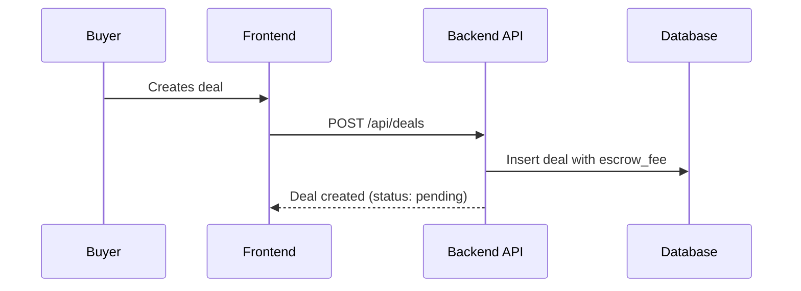
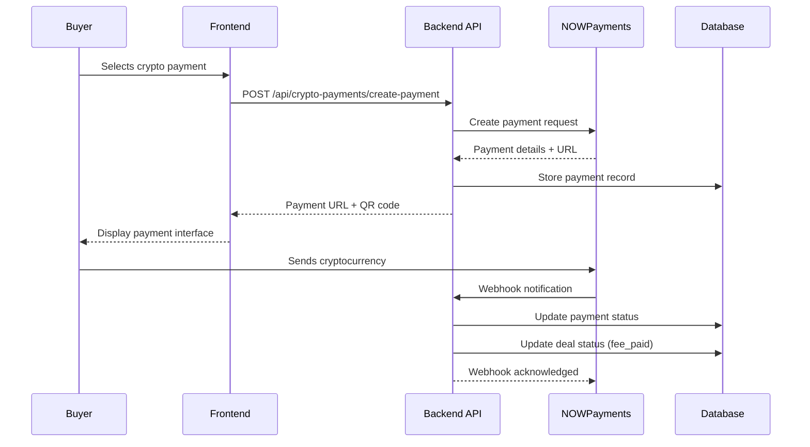
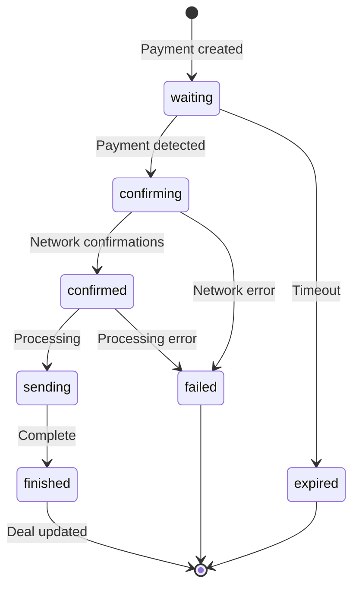

# XSM Market - Complete NOWPayments Cryptocurrency Integration

## 🚀 Overview

This document describes the complete NOWPayments cryptocurrency payment system integrated into XSM Market. The system allows buyers and sellers to pay the 7% escrow fee using various cryptocurrencies including Bitcoin, Ethereum, USDT, and more.

## 🏗️ System Architecture

### Backend Components

#### 1. NOWPayments API Service (`utils/NOWPaymentsAPI.php`)
- Handles all communication with NOWPayments API
- Supports both sandbox and production environments
- Manages payment creation, status checking, and currency listing
- Includes IPN signature verification for webhooks

#### 2. Cryptocurrency Payments API (`api/crypto-payments.php`)
- RESTful API endpoints for crypto payment operations
- Authenticated routes requiring JWT tokens
- Handles payment creation and status tracking

#### 3. Webhook Handler (`webhooks/nowpayments.php`)
- Processes NOWPayments IPN callbacks
- Verifies webhook signatures for security
- Updates payment status and deal status automatically
- Comprehensive logging for debugging

#### 4. Database Schema (`crypto_payments` table)
```sql
CREATE TABLE crypto_payments (
    id INT AUTO_INCREMENT PRIMARY KEY,
    deal_id INT NOT NULL,
    nowpayments_payment_id VARCHAR(255) NOT NULL UNIQUE,
    order_id VARCHAR(255) NOT NULL,
    payment_status ENUM('waiting', 'confirming', 'confirmed', 'sending', 'finished', 'failed', 'refunded', 'expired'),
    price_amount DECIMAL(20, 8) NOT NULL,
    price_currency VARCHAR(10) NOT NULL DEFAULT 'usd',
    actually_paid DECIMAL(20, 8) NULL,
    pay_currency VARCHAR(10) NULL,
    outcome_amount DECIMAL(20, 8) NULL,
    outcome_currency VARCHAR(10) NULL,
    payment_url TEXT NULL,
    qr_code_url TEXT NULL,
    webhook_data JSON NULL,
    created_at TIMESTAMP DEFAULT CURRENT_TIMESTAMP,
    updated_at TIMESTAMP DEFAULT CURRENT_TIMESTAMP ON UPDATE CURRENT_TIMESTAMP,
    FOREIGN KEY (deal_id) REFERENCES deals(id) ON DELETE CASCADE
);
```

### Frontend Components

#### 1. CryptoPaymentModal (`src/components/CryptoPaymentModal.tsx`)
- React modal component for cryptocurrency payments
- Currency selection interface
- Real-time payment status updates
- QR code display for mobile payments
- Auto-refresh payment status every 10 seconds

#### 2. Updated TransactionFeePayment Component
- Integrated crypto payment option alongside Stripe
- Seamless user experience switching between payment methods

## 🔧 Configuration

### Environment Variables (`.env`)
```bash
# NOWPayments Configuration
NOW_PAYMENTS_API_KEY_PRODUCTION=your_production_api_key
NOW_PAYMENTS_IPN_SECRET_PRODUCTION=your_production_ipn_secret
NOW_PAYMENTS_API_KEY_SANDBOX=M34GE97-CT5M1G4-NDRJ4RE-W6WGQ94
NOW_PAYMENTS_IPN_SECRET_SANDBOX=ZJKbVZ1hQXkUmkN4XZX/FsCkXVWYgQJJ

# NOWPayments Settings
NOW_PAYMENTS_ENVIRONMENT=sandbox
NOW_PAYMENTS_API_URL_SANDBOX=https://api-sandbox.nowpayments.io/v1
NOW_PAYMENTS_API_URL_PRODUCTION=https://api.nowpayments.io/v1
NOW_PAYMENTS_WEBHOOK_URL=https://ab45f1494014.ngrok-free.app/webhooks/nowpayments
```

### Webhook Configuration
- **URL**: `https://ab45f1494014.ngrok-free.app/webhooks/nowpayments`
- **Method**: POST
- **Signature Verification**: HMAC SHA-512
- **Auto-retry**: Enabled for failed webhooks

## 🔄 Payment Flow

### 1. Deal Creation


### 2. Cryptocurrency Payment Process


### 3. Status Updates


## 🛠️ API Endpoints

### Cryptocurrency Payments
- `GET /api/crypto-payments/currencies` - List supported cryptocurrencies
- `GET /api/crypto-payments/estimate?amount=X&from=usd&to=btc` - Get price estimate
- `POST /api/crypto-payments/create-payment` - Create new crypto payment
- `GET /api/crypto-payments/payments/{dealId}/status` - Check payment status

### Webhook
- `POST /webhooks/nowpayments` - NOWPayments IPN callback

## 🔒 Security Features

### 1. Authentication
- JWT tokens required for all payment operations
- User authorization checks (only deal participants can pay)

### 2. Webhook Security
- HMAC SHA-512 signature verification
- Environment-specific IPN secrets
- Comprehensive request logging

### 3. Data Validation
- Input sanitization and validation
- SQL injection protection via prepared statements
- XSS prevention

### 4. Error Handling
- Graceful error handling with user-friendly messages
- Detailed server-side logging
- Transaction rollback on failures

## 💳 Supported Cryptocurrencies

The system supports major cryptocurrencies including:
- Bitcoin (BTC)
- Ethereum (ETH)
- Tether (USDT)
- USD Coin (USDC)
- Litecoin (LTC)
- Ripple (XRP)
- Cardano (ADA)
- Polkadot (DOT)
- Binance Coin (BNB)
- Solana (SOL)

## 🧪 Testing

### 1. Integration Test
```bash
cd php-backend
php test_nowpayments_integration.php
```

### 2. API Testing
```bash
# Start PHP server
php -S localhost:8000

# Test NOWPayments connection
curl http://localhost:8000/api/test-nowpayments
```

### 3. Webhook Testing
Use ngrok to expose local server:
```bash
ngrok http 8000
# Update NOW_PAYMENTS_WEBHOOK_URL in .env
```

## 📊 Database Integration

### Deal Status Updates
When crypto payment is completed:
1. `deals.transaction_fee_paid` = 1
2. `deals.transaction_fee_paid_at` = NOW()
3. `deals.transaction_fee_payment_method` = 'crypto'
4. `deals.deal_status` = 'fee_paid'

### History Tracking
All payment events are logged in `deal_history` table with detailed descriptions.

## 🎯 User Experience

### 1. Payment Selection
- Clear interface showing crypto vs traditional payment options
- Real-time fee estimates
- Security notices and instructions

### 2. Payment Process
- Multiple payment methods (QR code, direct URL, wallet integration)
- Real-time status updates
- Auto-refresh every 10 seconds
- Success/failure notifications

### 3. Mobile Optimization
- QR codes for easy mobile wallet scanning
- Responsive design for all devices
- Touch-friendly interface

## 🚀 Deployment

### Production Setup
1. Update environment variables for production
2. Configure production NOWPayments API keys
3. Set up production webhook URL
4. Enable HTTPS for all endpoints
5. Configure proper CORS settings

### Monitoring
- Check webhook logs: `php-backend/logs/webhook.log`
- Monitor payment status in database
- Set up alerts for failed payments

## 🔧 Troubleshooting

### Common Issues
1. **Webhook not receiving**: Check ngrok URL and firewall settings
2. **Payment not updating**: Verify IPN secret and signature verification
3. **Currency not supported**: Check NOWPayments API documentation
4. **Database errors**: Verify table schema and permissions

### Debug Tools
- Webhook logging enabled by default
- API error responses include detailed messages
- Integration test script for quick diagnostics

## 📈 Future Enhancements

1. **Multi-currency Support**: Accept payments in different base currencies
2. **Refund System**: Automated refund processing for failed deals
3. **Advanced Analytics**: Payment method preferences and conversion rates
4. **Mobile App Integration**: Deep linking for mobile wallet payments
5. **Stablecoin Priority**: Prefer stable cryptocurrencies for price stability

---

This complete integration provides a robust, secure, and user-friendly cryptocurrency payment system that seamlessly integrates with your existing XSM Market platform. The modular design allows for easy maintenance and future enhancements.
