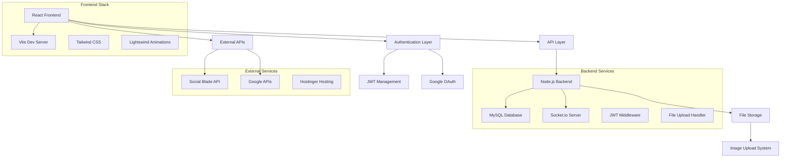

# 🏆 XSM Market
**Premium Digital Channel Marketplace Platform**

[](https://reactjs.org/)
[](https://www.typescriptlang.org/)
[](https://vitejs.dev/)
[](https://nodejs.org/)
[](https://www.mysql.com/)
[](https://socket.io/)
[](https://tailwindcss.com/)
[](https://developers.google.com/identity)

---

## 📖 Table of Contents
- [🎯 Overview](#-overview)
- [✨ Features](#-features)
- [🏗️ Architecture](#️-architecture)
- [🚀 Quick Start](#-quick-start)
- [📁 Project Structure](#-project-structure)
- [🔧 Configuration](#-configuration)
- [🛠️ Development](#️-development)
- [🎨 UI Components](#-ui-components)
- [📊 Database Schema](#-database-schema)
- [🔐 Security](#-security)
- [🚀 Deployment](#-deployment)
- [🔍 API Documentation](#-api-documentation)
- [📱 Features Showcase](#-features-showcase)
- [🤝 Contributing](#-contributing)
- [📄 License](#-license)

---

## 🎯 Overview

XSM Market is a cutting-edge digital marketplace platform that revolutionizes the buying and selling of social media channels, YouTube accounts, and digital assets. Built with modern web technologies, it provides a secure, scalable, and user-friendly environment for digital entrepreneurs.

### 🎯 Problem We Solve
- **Unsafe digital asset transactions** with no verification or escrow
- **Lack of trust** between buyers and sellers in digital marketplaces
- **No standardized pricing** for digital channels and assets
- **Poor user experience** in existing marketplace platforms
- **Limited communication tools** for negotiations

### 💡 Our Solution
A comprehensive platform that provides:
- **Secure escrow system** for safe transactions
- **Advanced verification system** for channel authenticity
- **Real-time chat system** for seamless communication
- **AI-powered analytics** with seasonal animations and smart UI
- **Professional marketplace interface** with premium user experience

---

## ✨ Features

### 🔐 Authentication & User Management
- **Multi-Provider Authentication**
  - Email/Password with OTP verification
  - Google OAuth integration
  - JWT-based session management with refresh tokens
- **Advanced Profile Management**
  - Profile picture upload with image optimization
  - Comprehensive user verification system
  - Activity tracking and reputation scoring

### 🛒 Marketplace Core
- **Advanced Channel Listings**
  - Multi-platform support (YouTube, Instagram, TikTok, etc.)
  - Rich media uploads with screenshot galleries
  - Detailed analytics and performance metrics
  - Automated channel verification via Social Blade API
- **Smart Search & Filtering**
  - Category-based filtering with 14+ categories
  - Price range and subscriber count filters
  - Advanced sorting algorithms
  - Real-time search suggestions

### 💬 Communication System
- **Real-time Chat Platform**
  - Socket.io powered instant messaging
  - File sharing capabilities
  - Message encryption and security
  - Chat history and message search
- **Deal Management**
  - Structured negotiation workflows
  - Offer and counter-offer system
  - Transaction tracking and status updates

### 🎨 Premium UI/UX
- **Lightswind Animation Library**
  - CountUp animations for dynamic numbers
  - Seasonal hover cards with auto-season detection
  - Smokey cursor effects
  - Interactive gradient animations
  - Scroll timeline progress indicators
- **Responsive Design**
  - Mobile-first approach
  - Dark theme with XSM branding
  - Smooth transitions and micro-interactions

### 📊 Analytics & Insights
- **Social Media Integration**
  - Social Blade API for channel verification
  - Automated data extraction and validation
  - Performance metrics and growth analytics
- **Business Intelligence**
  - Sales performance tracking
  - Market trend analysis
  - Revenue optimization insights

---

## 🏗️ Architecture



### 🧩 Technology Stack

| **Category** | **Technology** | **Purpose** |
|-------------|---------------|-------------|
| **Frontend** | React 18.3.1, TypeScript 5.5.3, Vite 5.4.1 | Modern SPA with type safety |
| **UI/UX** | Tailwind CSS, Lightswind, Radix UI | Responsive design & animations |
| **State Management** | React Context, Custom Hooks | Application state management |
| **Authentication** | JWT, Google OAuth, OTP | Secure user authentication |
| **Backend** | Node.js, Express.js | RESTful API server |
| **Database** | MySQL, Structured Schema | Relational data management |
| **Real-time** | Socket.io | Live chat and notifications |
| **External APIs** | Social Blade, Google APIs | Channel verification & data |
| **File Handling** | Multer, Image Processing | Media upload management |
| **Deployment** | Hostinger, Docker | Production hosting |

---

## 🚀 Quick Start

### 📋 Prerequisites
- **Node.js** 18+ and npm
- **MySQL** 8.0+ database server
- **Git** for version control
- **Google Cloud Console** account (for OAuth)
- **Social Blade API** access (optional)

### ⚡ Installation

1. **Clone the repository**
   ```bash
   git clone https://github.com/Huzaifanasir95/xsm-market.git
   cd xsm-market
   ```

2. **Install dependencies**
   ```bash
   # Install root dependencies
   npm install
   
   # Install backend dependencies
   cd backend && npm install && cd ..
   ```

3. **Set up environment variables**
   ```bash
   # Copy environment templates
   cp .env.example .env
   cp backend/.env.example backend/.env
   ```
   
   Edit `.env` files with your configuration:
   ```env
   # Frontend (.env)
   VITE_API_URL=http://localhost:3000
   VITE_GOOGLE_CLIENT_ID=your-google-client-id
   VITE_SOCIAL_BLADE_API_KEY=your-social-blade-key
   
   # Backend (backend/.env)
   DB_HOST=localhost
   DB_USER=your-mysql-user
   DB_PASSWORD=your-mysql-password
   DB_NAME=xsm_market
   JWT_SECRET=your-super-secret-jwt-key
   GOOGLE_CLIENT_ID=your-google-client-id
   GOOGLE_CLIENT_SECRET=your-google-client-secret
   ```

4. **Set up the database**
   ```bash
   # Create database and import schema
   mysql -u root -p < database_schema_complete.sql
   
   # Or run setup script
   npm run db:setup
   ```

5. **Start the development servers**
   ```bash
   # Start both frontend and backend
   npm run dev
   
   # Or start individually
   npm run dev:frontend  # Frontend on http://localhost:5173
   npm run dev:backend   # Backend on http://localhost:3000
   ```

6. **Access the application**
   Open [http://localhost:5173](http://localhost:5173) in your browser.

### 🔧 Google OAuth Setup
1. **Create Google Cloud Project**
2. **Enable Google+ API**
3. **Create OAuth 2.0 credentials**
4. **Add authorized redirect URIs**:
   - `http://localhost:5173` (development)
   - `https://your-domain.com` (production)

---

## 📁 Project Structure

```
xsm-market/
│
├── 📁 backend/                    # Node.js Express Backend
│   ├── 📁 config/                # Database and app configuration
│   │   ├── database.js           # MySQL connection setup
│   │   └── multer.js             # File upload configuration
│   ├── 📁 controllers/           # Business logic controllers
│   │   ├── authController.js     # Authentication handlers
│   │   ├── adController.js       # Ad management
│   │   ├── chatController.js     # Chat functionality
│   │   └── userController.js     # User management
│   ├── 📁 middleware/            # Express middleware
│   │   ├── auth.js               # JWT authentication
│   │   ├── validation.js         # Input validation
│   │   └── upload.js             # File upload handling
│   ├── 📁 models/                # Database models
│   │   ├── User.js               # User model
│   │   ├── Ad.js                 # Advertisement model
│   │   └── Chat.js               # Chat model
│   ├── 📁 routes/                # API route definitions
│   │   ├── auth.js               # Authentication routes
│   │   ├── ads.js                # Advertisement routes
│   │   ├── chat.js               # Chat routes
│   │   └── users.js              # User routes
│   ├── 📁 utils/                 # Utility functions
│   │   ├── emailService.js       # Email handling
│   │   └── socialBlade.js        # Social Blade integration
│   ├── server.js                 # Express server entry point
│   └── package.json              # Backend dependencies
│
├── 📁 src/                       # React Frontend Source
│   ├── 📁 components/            # React components
│   │   ├── 📁 ui/                # Base UI components
│   │   │   ├── Button.tsx        # Custom button component
│   │   │   ├── Input.tsx         # Form input component
│   │   │   ├── Modal.tsx         # Modal dialog component
│   │   │   └── smokey-cursor.tsx # Animated cursor effect
│   │   ├── 📁 lightswind/        # Animation components
│   │   │   ├── count-up.tsx      # Number counting animation
│   │   │   ├── seasonal-hover-cards.tsx # Seasonal card effects
│   │   │   ├── interactive-gradient.tsx # Gradient animations
│   │   │   └── scroll-timeline.tsx # Scroll progress indicator
│   │   ├── AdList.tsx            # Advertisement listing
│   │   ├── ChannelCard.tsx       # Channel display card
│   │   ├── ChannelModal.tsx      # Channel details modal
│   │   ├── Chat.tsx              # Chat interface
│   │   ├── Navbar.tsx            # Navigation component
│   │   ├── AuthWidget.tsx        # Authentication modal
│   │   └── UserAdList.tsx        # User's advertisements
│   ├── 📁 pages/                 # Page components
│   │   ├── Home.tsx              # Marketplace homepage
│   │   ├── Profile.tsx           # User profile page
│   │   ├── SellChannel.tsx       # Create listing page
│   │   ├── Chat.tsx              # Chat interface page
│   │   ├── Login.tsx             # Login page
│   │   ├── Signup.tsx            # Registration page
│   │   └── AdminDashboard.tsx    # Admin panel
│   ├── 📁 context/               # React Context providers
│   │   ├── AuthContext.tsx       # Authentication context
│   │   └── AuthProvider.tsx      # Auth provider wrapper
│   ├── 📁 services/              # API service functions
│   │   ├── auth.js               # Authentication services
│   │   ├── ads.js                # Advertisement services
│   │   ├── chat.js               # Chat services
│   │   └── socialMedia.js        # Social media integration
│   ├── 📁 hooks/                 # Custom React hooks
│   │   ├── useAuth.ts            # Authentication hook
│   │   ├── useChat.ts            # Chat functionality hook
│   │   └── useTokenManager.ts    # Token management hook
│   ├── 📁 utils/                 # Utility functions
│   │   ├── api.ts                # API configuration
│   │   └── validation.ts         # Form validation
│   ├── App.tsx                   # Main application component
│   └── main.tsx                  # React entry point
│
├── 📁 public/                    # Static assets
│   ├── images/                   # Image assets
│   ├── icons/                    # Icon files
│   └── favicon.ico               # Site favicon
│
├── 📁 scripts/                   # Utility scripts
│   ├── deploy-hostinger.js       # Deployment automation
│   ├── setup-local.js            # Local development setup
│   └── setup-local-db.sh         # Database setup script
│
├── 📁 docs/                      # Documentation
│   ├── API_DOCUMENTATION.md      # API endpoint documentation
│   ├── CHAT_SYSTEM_DOCUMENTATION.md # Chat system guide
│   ├── ADMIN_ACCESS_CONTROL.md   # Admin features guide
│   └── SOCIAL_BLADE_SETUP_GUIDE.md # Social Blade integration
│
├── 📄 Configuration Files
├── package.json                  # Root dependencies and scripts
├── vite.config.ts               # Vite configuration
├── tailwind.config.ts           # Tailwind CSS configuration
├── tsconfig.json                # TypeScript configuration
├── eslint.config.js             # ESLint configuration
├── database_schema_complete.sql  # Complete database schema
├── .env.example                 # Environment template
├── .gitignore                   # Git ignore rules
└── README.md                    # This documentation
```

---

## 🔧 Configuration

### 🌍 Environment Variables

#### Frontend Configuration
| **Variable** | **Description** | **Required** | **Example** |
|-------------|----------------|-------------|-------------|
| `VITE_API_URL` | Backend API base URL | ✅ | `http://localhost:3000` |
| `VITE_GOOGLE_CLIENT_ID` | Google OAuth client ID | ✅ | `123456789-abc.apps.googleusercontent.com` |
| `VITE_SOCIAL_BLADE_API_KEY` | Social Blade API key | ❌ | `your-social-blade-api-key` |

#### Backend Configuration
| **Variable** | **Description** | **Required** | **Example** |
|-------------|----------------|-------------|-------------|
| `DB_HOST` | MySQL database host | ✅ | `localhost` |
| `DB_USER` | MySQL username | ✅ | `xsm_user` |
| `DB_PASSWORD` | MySQL password | ✅ | `secure_password` |
| `DB_NAME` | Database name | ✅ | `xsm_market` |
| `JWT_SECRET` | JWT signing secret | ✅ | `your-super-secret-jwt-key` |
| `GOOGLE_CLIENT_ID` | Google OAuth client ID | ✅ | `123456789-abc.apps.googleusercontent.com` |
| `GOOGLE_CLIENT_SECRET` | Google OAuth client secret | ✅ | `your-google-client-secret` |
| `PORT` | Server port | ❌ | `3000` |

### 🗄️ Database Setup

```sql
-- Create database
CREATE DATABASE xsm_market CHARACTER SET utf8mb4 COLLATE utf8mb4_unicode_ci;

-- Import complete schema
SOURCE database_schema_complete.sql;

-- Verify tables
SHOW TABLES;
```

Key database tables:
- `users` - User accounts and profiles
- `ads` - Channel listings and advertisements
- `chats` - Chat conversations
- `messages` - Individual chat messages
- `deals` - Transaction records
- `categories` - Listing categories
- `admin_users` - Administrative accounts

---

## 🛠️ Development

### 📝 Available Scripts

```bash
# Development
npm run dev              # Start both frontend and backend
npm run dev:frontend     # Start frontend only (Vite)
npm run dev:backend      # Start backend only (Node.js)
npm run build           # Build frontend for production
npm run preview         # Preview production build

# Database
npm run db:setup        # Set up database schema
npm run db:setup-local  # Set up local development database

# Deployment
npm run deploy          # Deploy to Hostinger
npm run clean           # Clean node_modules and dist
npm run clean:deploy    # Clean deployment artifacts

# Local Setup
npm run setup-local     # Complete local environment setup
```

### 🏗️ Development Workflow

1. **Feature Development**
   ```bash
   git checkout -b feature/your-feature-name
   npm run dev  # Start development servers
   # Make your changes
   npm run build  # Test production build
   git commit -m "feat: add your feature"
   git push origin feature/your-feature-name
   ```

2. **Backend API Development**
   ```bash
   cd backend
   npm run dev  # Start backend with nodemon
   # Test endpoints with Postman or curl
   ```

3. **Database Changes**
   ```bash
   # Update schema files
   vim database_schema_complete.sql
   npm run db:setup  # Apply changes
   ```

### 🔍 Testing & Debugging

1. **Frontend Testing**
   ```bash
   # Check for TypeScript errors
   npx tsc --noEmit
   
   # Run ESLint
   npx eslint src/
   ```

2. **Backend Testing**
   ```bash
   # Test API endpoints
   curl http://localhost:3000/api/health
   
   # Check database connection
   node backend/config/database.js
   ```

3. **Integration Testing**
   ```bash
   # Test authentication flow
   node test-google-signin.html
   
   # Test social media integration
   node test-social-blade-integration.js
   ```

---

## 🎨 UI Components

### ✨ Lightswind Animation Library

The project features a custom animation library with these components:

#### 📊 CountUp Component
```tsx
import { CountUp } from '@/components/lightswind/count-up';

<CountUp 
  value={1250} 
  prefix="$" 
  duration={2}
  animationStyle="spring"
  colorScheme="default"
/>
```

**Features:**
- Multiple easing functions (ease-in, ease-out, spring, bounce)
- Intersection Observer triggering
- Interactive hover animations
- Color scheme support

#### 🌟 Seasonal Hover Cards
```tsx
import { SeasonalHoverCards } from '@/components/lightswind/seasonal-hover-cards';

<SeasonalHoverCards
  season="auto"
  intensity="medium"
  particleCount={12}
  enableGlow={true}
>
  <div>Your content</div>
</SeasonalHoverCards>
```

**Features:**
- Auto-season detection (Spring, Summer, Autumn, Winter)
- Particle effects and animations
- Dynamic color schemes
- Customizable intensity levels

#### 🖱️ Smokey Cursor
```tsx
import SmokeyCursor from '@/components/ui/smokey-cursor';

<SmokeyCursor 
  color="#fbbf24"
  particleCount={20}
  intensity="medium"
  enabled={true}
/>
```

**Features:**
- Canvas-based particle system
- Mouse-following smoke trail
- Performance optimized
- Customizable colors and intensity

#### 📈 Scroll Timeline
```tsx
import { ScrollTimeline } from '@/components/lightswind/scroll-timeline';

<ScrollTimeline 
  position="top"
  showMilestones={true}
  milestones={[25, 50, 75]}
  color="#fbbf24"
/>
```

**Features:**
- Real-time scroll progress
- Multiple positioning options
- Milestone markers
- Smooth animations

### 🎨 Design System

- **Color Palette:**
  - Primary: XSM Yellow (#fbbf24)
  - Background: Dark theme with gradients
  - Text: White with gray variants
  - Accent: Blue and green for status indicators

- **Typography:**
  - Font family: System fonts with fallbacks
  - Responsive font sizes
  - Consistent line heights

- **Spacing:**
  - Tailwind CSS spacing scale
  - Consistent margins and padding
  - Responsive breakpoints

---

*Continue to iterate for the complete README...*
